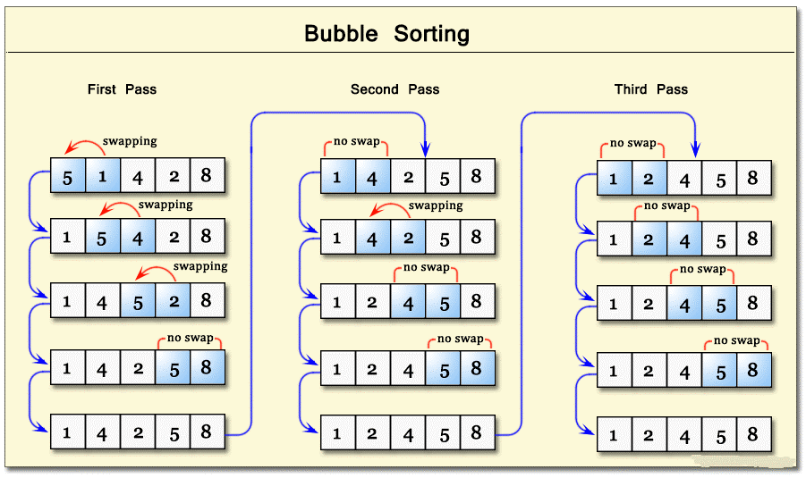
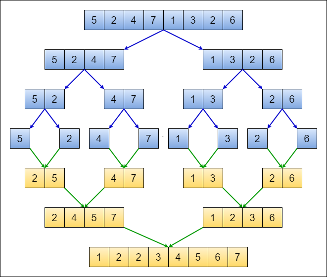
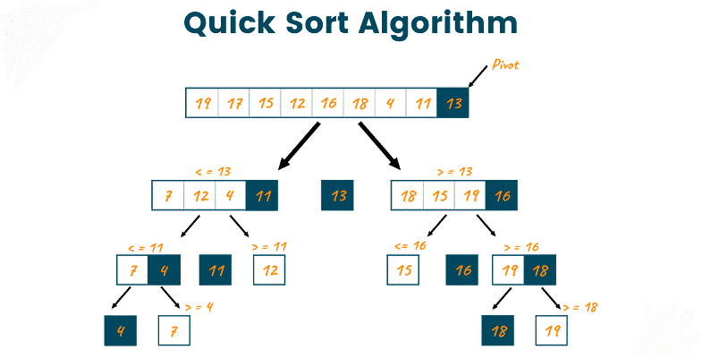

# ImplAlgorithms
## Sorting Algorithms

## Bubble Sort
- Complexity: O(n^2)
- Description: Bubble sort is a simple sorting algorithm that repeatedly steps through the list, compares each pair of adjacent items, and swaps them if they are in the wrong order.
- Implementation: `ImplAlgorithms.Sorting.BubbleSort`

### Graphical Example of Bubble Sort:
  

## Counting Sort
- Complexity: O(n + k) where k = maxElement - minElement
- Description: Counting sort is a non-comparison based sorting algorithm that counts the number of occurrences of each element and uses this information to sort the array.
- Implementation: `ImplAlgorithms.Sorting.CountingSort`

### Graphical Example of Counting Sort:

## Merge Sort
- Complexity: O(n * log n)
- Description: Merge sort is a divide and conquer algorithm that divides the array into smaller subarrays, sorts them, and then merges them back together.
- Implementation: `ImplAlgorithms.Sorting.MergeSort`

### Graphical Example of Merge Sort:

## Quick Sort
- Complexity: O(n * log n) average case, O(n^2) worst case
- Description: Quick sort is a divide and conquer algorithm that selects a pivot element and partitions the array around the pivot such that elements smaller than the pivot are on the left and elements larger are on the right.
- Implementation: `ImplAlgorithms.Sorting.QuickSort`

### Graphical Example of Quick Sort:

## Utility: Prime Numbers 
- Complexity: O(n * log(log n))
- Description: Utility class to generate a list of prime numbers up to a given number using the Sieve of Eratosthenes algorithm.
- Implementation: `ImplAlgorithms.Utils.PrimNumber`

# Binary Search
- Complexity: O(log n)
- Description: Binary search is an algorithm for finding an element within a sorted array by repeatedly dividing the portion of the array that could contain the element in half and comparing the target element with the middle element. This process continues until the element is found or only one element remains.
- Implementation: `ImplAlgorithms.Searching.BinarySearch`

### Graphical Example of Binary Search:

## Graph Algorithms
### Depth-First Search (DFS)
- Class: `ImplAlgorithms.Graph.DFS`
- Description: Depth-First Search (DFS) is a graph traversal algorithm that explores each possible branch of a path until it finds the target or explores the entire graph.
- Complexity: O(V + E)

### Graphical Example of Depth-First Search (DFS):

